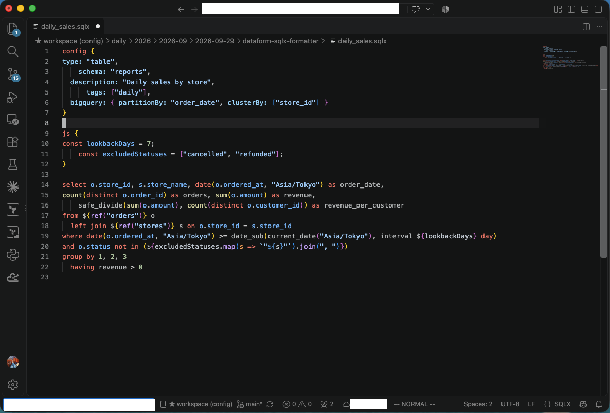
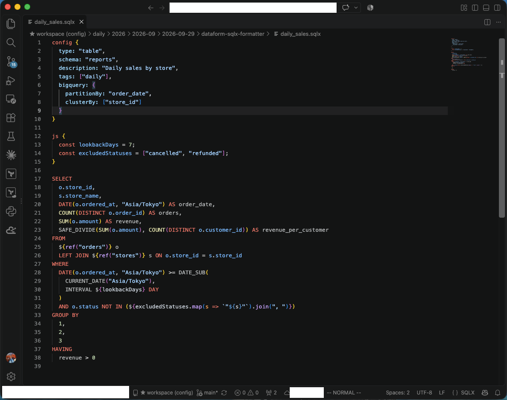
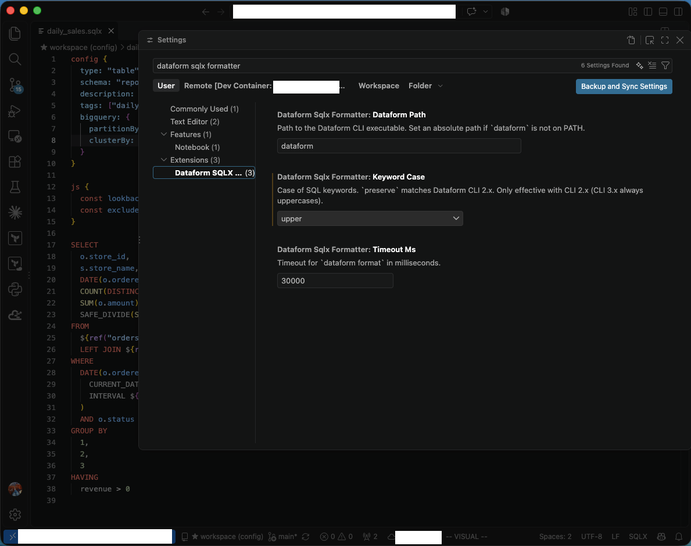

# Dataform SQLX Formatter

**Format the `.sqlx` file you're editing — with exactly the same result as `dataform format`.**

Press `Shift+Alt+F` (`Shift+Option+F` on macOS) and only the current file is formatted, by the Dataform CLI's own formatter. No more running `dataform format` over the whole project, and no more fights with your pre-commit hook or CI.

| Before | After |
|---|---|
|  |  |

## Why this extension?

`dataform format` is the formatter your team already agreed on, but it only works on the **entire project**:

- You can't format just the file you're working on.
- Running it touches every unformatted file in the repo, so your PR fills up with unrelated diffs.
- Other SQL formatters in VS Code produce *different* output, so the `dataform format` pre-commit hook or CI check rewrites your file again.

This extension copies the current file into a throwaway project, lets the Dataform CLI format it there, and applies the result as a normal editor edit. The output is byte-for-byte what `dataform format` would produce.

Verified on a real-world project with 332 `.sqlx` files: every file formatted on its own matched `dataform format` on the whole project, with both CLI 2.9.0 and 3.0.71.

## Features

- **Same output as `dataform format`** — uses the CLI you already have installed, not a re-implementation.
- **One file at a time** — nothing outside the current editor is touched.
- **Works like any VS Code formatter** — Format Document, Format on Save, and a single `Cmd+Z` / `Ctrl+Z` to undo.
- **Uppercase keywords with CLI 2.x** — optional `keywordCase` setting. The result is stable under a stock `dataform format`, so it never fights your hook.
- **Won't corrupt broken files** — if a file has a syntax error, formatting is skipped instead of mangling your `${...}` expressions.
- **Dev Containers and remote workspaces** — runs on the machine where the Dataform CLI is installed.

## Getting started

1. Install the Dataform CLI if you haven't already:
   ```bash
   npm i -g @dataform/cli
   ```
2. Install this extension.
3. Open a `.sqlx` file and run **Format Document** (`Shift+Alt+F` / `Shift+Option+F`).

That's it. `.sqlx` files use this extension as their default formatter automatically.

To format on every save, add this to your settings:

```json
"[sqlx]": {
  "editor.formatOnSave": true
}
```

## Settings



| Setting | Default | Description |
|---|---|---|
| `dataformSqlxFormatter.keywordCase` | `preserve` | `upper` / `lower` to change the case of SQL keywords (CLI 2.x only). `preserve` matches `dataform format`. |
| `dataformSqlxFormatter.dataformPath` | `dataform` | Path to the Dataform CLI. Set an absolute path if `dataform` is not on your `PATH`. |
| `dataformSqlxFormatter.timeoutMs` | `30000` | Timeout for one format run, in milliseconds. |

The SQL dialect is read from `warehouse` in the nearest `dataform.json` (default: `bigquery`).

## FAQ

**Which Dataform CLI versions are supported?**
2.x and 3.x. Tested with 2.9.0 and 3.0.71. The extension always uses the CLI you have installed, so the result matches what `dataform format` gives you on your machine.

**Why don't keywords become uppercase?**
CLI 2.x keeps keywords as you wrote them. Set `dataformSqlxFormatter.keywordCase` to `upper`. CLI 3.x always uppercases keywords, so the setting has no effect there.

**Will uppercasing keywords conflict with my `dataform format` pre-commit hook?**
No. CLI 2.x never changes keyword case, so the uppercased result passes through `dataform format` unchanged.

**Formatting did nothing and a warning appeared.**
Either the CLI could not format the file (it can't format some complex files), or the file has a syntax error and the result would have corrupted it. The details are in the **Dataform SQLX Formatter** output channel (View → Output).

**"Could not run dataform"**
The CLI was not found. Install it with `npm i -g @dataform/cli`, or set `dataformSqlxFormatter.dataformPath` to its absolute path.

## Development

```bash
npm install
npm run package          # builds dataform-sqlx-formatter-<version>.vsix
```

`test/verify-against-cli.js` checks, on a real Dataform project, that formatting each file on its own matches `dataform format` on the whole project:

```bash
# In a clean git working copy of a Dataform project, format everything without committing,
# so HEAD holds the original files and the working tree holds the CLI's output.
(cd <project> && dataform format .)
node test/verify-against-cli.js <project>                        # compare with the CLI output
node test/verify-against-cli.js <project> --keyword-case=upper   # check stability under the stock CLI
```

Issues and pull requests are welcome at [GitHub](https://github.com/happy-engine1/dataform-sqlx-formatter).

## License

[MIT](LICENSE)
